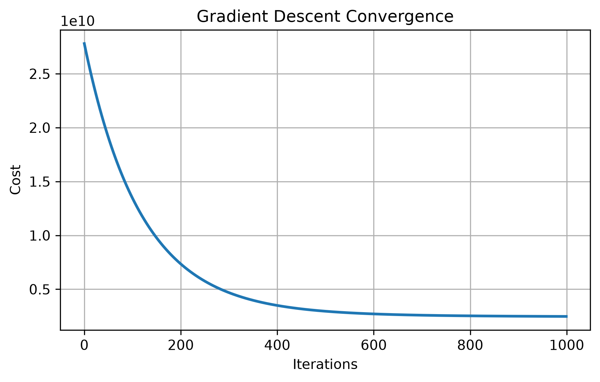
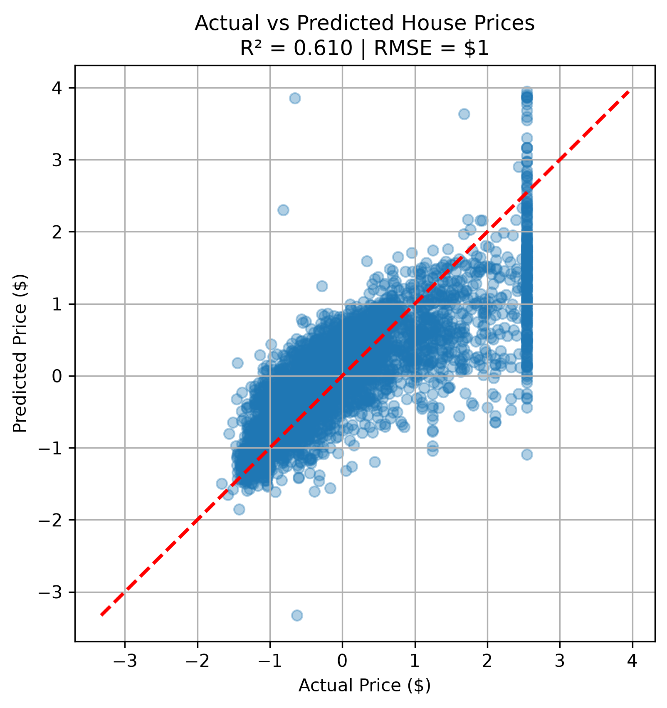
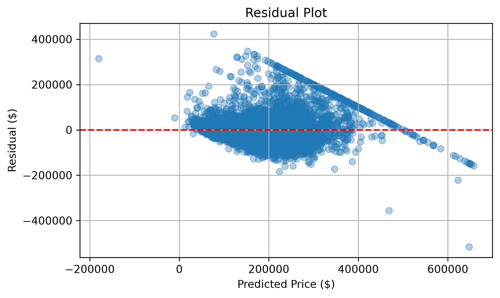

# Linear Regression from Scratch (NumPy)

A complete implementation of **Multiple Linear Regression** using only **NumPy**, without scikit-learn. This project builds the learning algorithm from first principles, including gradient descent, feature normalization, cost optimization, and model evaluation.

---

## Results

| Metric | Score |
|---------|------:|
| **R² Score** | **0.609** |
| **RMSE** | **$72,552** |

The model is trained on the **California Housing** dataset and evaluated using an 80/20 train-test split.

---

## Project Structure

```text
LinearRegression-From-Scratch/
│
├── data/
│   └── housing.csv
│
├── images/
│   ├── cost_curve.png
│   ├── actual_vs_predicted.png
│   └── residual_plot.png
│
├── src/
│   ├── train.py
│   ├── model.py
│   ├── utils.py
│
├── requirements.txt
├── LICENSE
└── README.md
```

---

## Features

- Multiple Linear Regression from scratch
- Batch Gradient Descent
- Feature normalization (Z-score)
- Random train/test split (80/20)
- Mean Squared Error cost function
- R² Score and RMSE evaluation
- Cost convergence visualization
- Residual analysis

---

## Mathematical Model


Prediction

```math \hat{y}=Xw+b ```

Cost Function (Mean Squared Error)

```math J(w,b)=\frac{1}{2m}\sum_{i=1}^{m}\left(\hat{y}^{(i)}-y^{(i)}\right)^2 ```

Gradient Update

```math w:=w-\alpha\frac{1}{m}X^{T}(\hat{y}-y) ```

```math b:=b-\alpha\frac{1}{m}\sum_{i=1}^{m}(\hat{y}-y) ```

Feature Normalization (Z-Score)

Each feature is standardized before training to improve convergence:

```math x_{norm}=\frac{x-\mu}{\sigma} ```

where:

μ = mean of the feature (computed from the training set)

σ = standard deviation of the feature

## Training Pipeline

1. Load housing dataset
2. Encode categorical features
3. Shuffle the dataset
4. Split into train and test sets (80/20)
5. Normalize training features
6. Apply the same normalization to test data
7. Train using gradient descent
8. Evaluate with RMSE and R²
9. Visualize predictions and residuals

---

## Visualizations

### Cost vs Iterations

The cost decreases smoothly, showing successful convergence.



---

### Actual vs Predicted Prices

Predicted prices compared with ground truth.



---

### Residual Plot

Residuals help identify model bias and prediction errors.



---

## Technologies Used

- Python 3
- NumPy
- Pandas
- Matplotlib

---

## Installation

```bash
git clone https://github.com/dipanshu-raj0102/LinearRegression-From-Scratch.git

cd LinearRegression-From-Scratch

pip install -r requirements.txt
```

---

## Run

```bash
cd src
python train.py
```

---

## Learning Objectives

This project was built to understand the complete mechanics of linear regression instead of relying on machine learning libraries. Every optimization step, gradient computation, and evaluation metric is implemented manually.

---

## Future Improvements

- L2 Regularization (Ridge Regression)
- L1 Regularization (Lasso)
- Polynomial Features
- Mini-batch Gradient Descent
- Learning Rate Scheduling

---

## License

This project is licensed under the MIT License.

---

## Author

**Dipanshu Raj**

GitHub: https://github.com/dipanshu-raj0102
